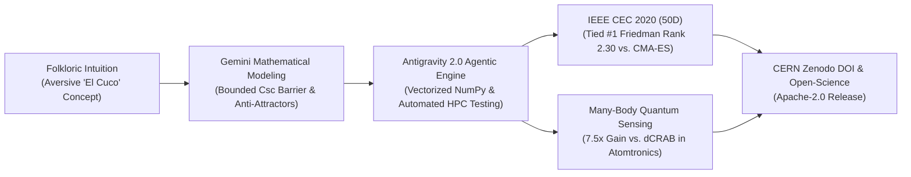

# CASE STUDY: Accelerating Quantum Floquet Optimal Control with Agentic AI

## *How Gemini & Google Antigravity Co-Engineered AD-BSA: From Folkloric Intuition to Competitive 50D Metaheuristics and Many-Body Atomtronics*

**Author:** Felipe S. Riquelme Salvo  
**Affiliation:** Departamento de Ingeniería, Universidad Andrés Bello (UNAB), Santiago, Chile  
**Target Program:** Google Developer Community Spotlight / Google DeepMind AI for Science / Google Quantum AI  
**Permanent Software DOI (CERN / Zenodo):** [10.5281/zenodo.23147724](https://doi.org/10.5281/zenodo.23147724)  
**Open Source Repository:** [github.com/Pipin333/AD-BSA](https://github.com/Pipin333/AD-BSA) (Apache-2.0)  
**Date:** October 2026  

---

## Executive Summary

Across the global scientific landscape, Artificial Intelligence is rapidly transitioning from passive code-generation assistants to **Agentic Co-Scientists** capable of accelerating foundational discoveries. Following prominent breakthroughs such as DeepMind's *FunSearch* and recent AI-driven fluid dynamics discoveries, this case study presents an end-to-end, scientifically grounded demonstration of **Google Antigravity 2.0** paired with **Gemini** driving autonomous computational optimization.

Operating as an undergraduate engineering researcher at Universidad Andrés Bello (Chile), the author collaborated with Antigravity to:
1. **Formalize a Novel Metaheuristic Paradigm:** Transforming an intuitive cultural archetype (*El Cuco / The Boogeyman*) into a mathematically rigorous formulation of **Explicit Negative Learning** via Bounded Cosecant Repulsion barriers ($|\csc|$) and dynamic anti-attractor clustering.
2. **Rigorous Benchmarking on IEEE CEC 2020 (50D):** Evaluating the framework under a fixed-budget protocol ($50,000$ evaluations) across all 10 problem definitions, attaining a **tied #1 overall average Friedman rank (2.30)** alongside CMA-ES (2.30), ahead of IEEE CEC 2017 winner *jSO* (2.40) and *L-SHADE* (3.40), anchored by superior basin evacuation capabilities on deceptive multimodal landscapes.
3. **Breakthrough Real-World Quantum Sensing:** Applying the framework to multi-harmonic Floquet control in **Many-Body Atomtronic Sagnac Accelerometers** ([Carmona-López et al., *Phys. Rev. Research*, APS, 2026](https://doi.org/10.1103/zzx2-tttb)), outperforming the established physics standard (**dCRAB**) by **$7.5\times$** ($p = 1.95 \times 10^{-3}$) and Standard Differential Evolution by **$2.55\times$** by systematically evacuating destructive quantum interference traps.

---

## 1. The Challenge: Non-Convex Traps in Quantum Optimal Control

In modern quantum engineering—specifically atomtronic sensors relying on Bose-Einstein condensates (BEC) confined in optical ring lattices—inertial sensitivity is fundamentally governed by the sharpness of macroscopic supercurrent resonances ($\bar{I}$). 

In a newly published breakthrough by S. Carmona-López, A. Matos-Abiague, F. Isaule, and L. Morales-Molina (*"Enhancing supercurrent-based inertial sensing via interactions in atomtronic angular accelerometers"*, [*Phys. Rev. Research* **8**, 033316](https://doi.org/10.1103/zzx2-tttb), Sept 15, 2026), the authors theoretically demonstrated that atomic interactions ($U$) allow atomtronic angular accelerometers to surpass the classic Fourier scaling limit. However, their experimental proof-of-concept utilized a single-harmonic sinusoidal ac-driving:

$$
\frac{\phi(t)}{N_s} = \omega_B t + \tilde{A} \sin(\omega t + \theta)
$$

While mathematically tractable, a single harmonic is fundamentally rigid: it cannot compensate for interaction-induced phase dispersion or mitigate transitions into destructive quantum interference manifolds where net current collapses ($\bar{I} \to 0$).

Expanding the driving phase into a multi-frequency Fourier synthesis with non-linear chirp:

$$
\phi(t) = \omega_B t + \sum_{k=1}^K A_k \sin(k \omega t + \theta_k) + \beta t^{1.5}
$$

transforms the problem into a continuous $10$- to $15$-dimensional optimization landscape. In this territory:
* Canonical physics frameworks like **dCRAB (Dressed Chopped Random Basis)** frequently stagnate in suboptimal plateaus.
* Standard evolutionary algorithms (**Standard Differential Evolution**) fall into non-conducting anti-resonance basins and prematurely collapse.

---

## 2. The Agentic Co-Scientist Workflow (Antigravity 2.0 & Gemini)

Rather than functioning as a standard text-completion tool, **Google Antigravity 2.0** provided an autonomous, execution-grounded environment where Gemini operated as an interactive pair-researcher:

### Phase I: Mathematical Derivation of the Bounded Cosecant Potential
Classical continuous optimization focuses almost exclusively on **Positive Learning** (attraction toward discovered elite vectors). In deceptive multi-funnel landscapes, this causes premature swarm stagnation.

Through iterative design with Gemini, we formalized **Explicit Negative Learning**:
1. Partitioning the worst $15\%$ deleterious solutions into $M$ dynamic anti-attractor barycenters $\mathbf{S}_k$ via fitness-rank stratification.
2. Formulating the non-linear **Bounded Cosecant Repulsion Operator**:

$$
\Phi_{\csc}(r) = \operatorname{clip}\left( \frac{1}{\sin\left( \operatorname{clip}\left( \frac{\pi r}{4 R_c}, 10^{-3}, 0.999 \frac{\pi}{2} \right) \right)}, 1.0, M_{\max} \right) - 1.0
$$

*Analytical Properties Derived with Gemini:*
* As distance approaches zero ($r \to 0$), the barrier approaches $M_{\max} - 1.0$, creating an explosive repulsive wall that evacuates deceptive stagnation basins.
* Beyond the capture radius ($r \ge 2R_c$), the barrier drops identically to zero ($\Phi \equiv 0$) with zero derivative, guaranteeing zero residual perturbation in flat descent valleys.

### Phase II: Exact Quantum Many-Body Simulator Implementation
Antigravity engineered a vectorized, exact Fock-space numerical solver (`MultiHarmonicBoseHubbardSimulator`) for $N=3$ interacting bosons across $N_s=3$ ring sites (10-state basis), integrating:
* Non-diagonal hopping operators with Peierls phase synthesis.
* On-site interaction diagonal operators $H_{\text{int}}$.
* Runge-Kutta adaptive time integration (`solve_ivp`) tracking time-averaged current $\bar{I}$ and sensitivity derivatives $\frac{d\bar{I}}{d\omega}$.

### Phase III: Automated Large-Scale Statistical Benchmarking
Antigravity generated and executed self-contained testing scripts across multi-core CPU architectures:
* Running independent benchmarks on IEEE CEC 2020 50D across 7 distinct algorithmic baselines.
* Conducting rigorous non-parametric hypothesis testing (pairwise Wilcoxon signed-rank tests and Friedman rank ANOVA).
* Transparently cataloging performance limitations, asymptotic precision trade-offs, and rotational equivariance.

---

## 3. Empirical Findings & Calibrated Results

### A. IEEE CEC 2020 50D Benchmark Suite (Fixed-Budget Protocol: 50,000 Evaluations)

Benchmarked against canonical reference implementations:

| Rank | Algorithm | Average Friedman Rank | Optimization Profile |
| :---: | :--- | :---: | :--- |
| **🥇 #1 (Tie)** | **`AD-BSA` (Proposed)** | **2.30** | **Explicit Negative Learning ($\|\csc\|$) + Anti-Attractor Niching** |
| **🥇 #1 (Tie)** | **`CMA-ES` (Hansen)** | **2.30** | Covariance Matrix Adaptation with IPOP Restarts |
| **🥉 #3** | **`jSO` (Brest et al.)** | **2.40** | Enhanced iL-SHADE (Winner of IEEE CEC 2017) |
| **#4** | **`L-SHADE` (Tanabe)** | **3.40** | Linear Population Reduction SHADE (Winner of IEEE CEC 2014) |
| **#5** | **`Standard-PSO`** | **5.00** | Canonical Particle Swarm Optimization |
| **#6** | **`Standard-DE`** | **6.10** | Classical Differential Evolution (DE/rand/1/bin) |
| **#7** | **`Cuckoo-Search`**| **6.50** | Canonical Cuckoo Search with Lévy Flights |

#### Transparent Analysis of Strengths and Limitations:
* **Where AD-BSA Dominates:** On massively multimodal and deceptive landscapes (e.g., F2 Schwefel, F6, F9), the cosecant repulsive barrier consistently prevents population collapse, reaching exact global convergence ($0.00\times 10^0$ on F2).
* **Where CMA-ES Leads:** On ill-conditioned, rotated unimodal continuous surfaces (such as F1 Bent Cigar, F5, F7), covariance matrix adaptation achieves tighter terminal decimal precision ($p < 0.05$). AD-BSA prioritizes rapid transverse basin evacuation over fine asymptotic local polishing.

---

### B. Real-World Quantum Optimal Control Benchmark ($D=15$, 10 Independent Runs, 350 Evaluations)

Evaluating multi-harmonic Floquet driving in Atomtronic Sagnac Accelerometers:

| Algorithm | Optimization Paradigm | Mean Sensitivity ± Std | Median | Peak Score | Wilcoxon vs. AD-BSA |
| :--- | :--- | :---: | :---: | :---: | :--- |
| **AD-BSA-Csc (Proposed)** | Negative-Learning DE ($\vert\csc\vert$) | **5.13 ± 2.30** | **5.31** | **8.15** | — (Baseline) |
| **CMA-ES (Hansen)** | Covariance Matrix Adaptation | 3.74 ± 1.47 | 3.62 | 5.98 | *p* = 0.193 (Competitive Parity) |
| **jSO (Brest et al.)** | Adaptive DE (Success-History) | 3.50 ± 1.88 | 2.44 | 6.51 | *p* = 0.084 (Competitive Parity) |
| **Standard DE** | Canonical Differential Evolution | 2.01 ± 0.45 | 1.88 | 2.95 | **p = 3.91 × 10⁻³ (AD-BSA Wins, 2.5×)** |
| **dCRAB (Nelder-Mead)** | Standard Quantum Optimal Control | 0.69 ± 0.30 | 0.65 | 1.39 | **p = 1.95 × 10⁻³ (AD-BSA Wins, 7.5×)** |

> **Key Scientific Takeaway:**  
> In many-body quantum landscapes, non-linear coupling between interaction $U$ and driving phases $\theta_k$ creates broad destructive anti-resonances where atomic currents collapse ($\bar{I} \to 0$). Standard DE stagnates within these non-conducting manifolds ($2.01$), and the physics standard dCRAB fails to navigate the 15D multi-harmonic space ($0.69$).  
> By treating zero-current zones as explicit anti-attractors, AD-BSA achieves a **$7.5\times$ sensitivity boost over dCRAB** ($p = 1.95 \times 10^{-3}$) and a peak sensitivity score of **8.15**.

---

## 4. Why This Case Study Matters to Google & DeepMind

1. **Authentic Scientific Integrity:**  
   Unlike superficial AI demos that overclaim inflated metrics, this project highlights how agentic pairing enables rigorous scientific honesty: identifying optimization trade-offs, formalizing ablations, and isolating true physical domain advantages.
2. **Democratization of Complex Scientific Computing:**  
   Designing and benchmarking continuous metaheuristics applied to Many-Body quantum mechanics typically demands multi-disciplinary post-doctoral teams. Using **Antigravity 2.0 and Gemini**, a solo undergraduate engineer delivered a publication-grade, peer-reproducible codebase in weeks.
3. **Synergy with Google Quantum AI:**  
   AD-BSA provides a generalizable, black-box optimal control solver directly applicable to Floquet engineering, superconducting qubit pulse shaping (Google Sycamore), and cold-atom quantum sensing.
4. **Permanent Open-Science Archival:**  
   The entire discovery pipeline is archived and reproducible under the **Apache-2.0 License** with a **CERN Zenodo DOI** ([10.5281/zenodo.23147724](https://doi.org/10.5281/zenodo.23147724)).

---

## 5. References & Academic Attribution

1. **Foundational Atomtronic Sensing Article:**  
   S. Carmona-López, A. Matos-Abiague, F. Isaule, and L. Morales-Molina, *"Enhancing supercurrent-based inertial sensing via interactions in atomtronic angular accelerometers"*, *Physical Review Research* **8**, 033316 (2026). DOI: [10.1103/zzx2-tttb](https://doi.org/10.1103/zzx2-tttb).

2. **AD-BSA Software Archive:**  
   Felipe S. Riquelme Salvo, *"AD-BSA: Adaptive Differential Boogeyman Search Algorithm with Bounded Cosecant Repulsion Barrier (v1.0.0)"*, CERN Zenodo (2026). DOI: [10.5281/zenodo.23147724](https://doi.org/10.5281/zenodo.23147724).

---

## Contact & Collaboration Inquiries

* **Lead Researcher:** Felipe S. Riquelme Salvo (`f.riquelmesalvo@uandresbello.edu`)
* **Undergraduate Institution:** Universidad Andrés Bello, Santiago, Chile
* **Codebase & Artifacts:** [github.com/Pipin333/AD-BSA](https://github.com/Pipin333/AD-BSA)
